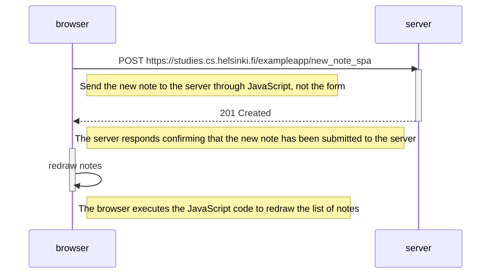

```mermaid
sequenceDiagram

    participant browser
    participant server

    browser->>server: POST https://studies.cs.helsinki.fi/exampleapp/new_note_spa
    activate server
    note right of browser: Send the new note to the server through JavaScript, not the form
    server-->>browser: 201 Created
    deactivate server
    note left of server: The server responds confirming that the new note has been submitted to the server

    activate browser
    browser->>browser: redraw notes
    deactivate browser
    note right of browser: The browser executes the JavaScript code to redraw the list of notes
```